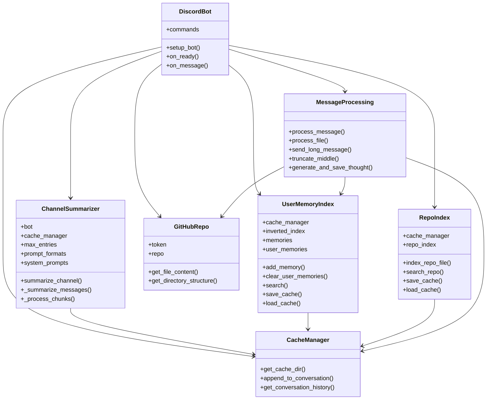

# Cognitive Discord Bot with Memory and GitHub Integration

<p align="center">
  
</p>

`TARS` is a memory-augmented Discord bot that models human-like cognition through dynamic memory storage, contextual awareness, and adaptive persona intensity.

## 🧠 Cognitive Architecture

The bot implements a cognitive architecture inspired by human memory and consciousness:

- **Episodic Memory**: Stores and indexes user interactions, conversations, and experiences
- **Working Memory**: Maintains active context through recent conversation history
- **Associative Recall**: Uses relevance-based memory search to inform responses
- **Memory Consolidation**: Generates "thoughts" about interactions to deepen understanding
- **Adaptive Personality**: Dynamic persona intensity (0-100) affects response creativity and style

## 🛠️ Core Features



### Memory System
- Indexes and stores user interactions with deduplication
- Contextual awareness of conversation history
- Relevance-based memory search
- User-specific memory isolation
- Memory consolidation through thought generation

### GitHub Integration
- Repository content indexing and search
- Code-aware interactions and analysis
- Smart prompt generation based on codebase

### Channel Management
- Conversation summarization
- Thread tracking
- File analysis (text and images)
- Smart message handling for long content

## 🔧 Tools and Commands

### Memory Management
- `!persona <0-100>`: Adjust bot's personality intensity
- `!add_memory <text>`: Add explicit memory
- `!clear_memories`: Clear user memories
- `!search_memories <query>`: Search memory index

### GitHub Tools
- `!index_repo`: Index repository contents
- `!ask_repo <question>`: Query about repository
- `!generate_prompt <file> <task>`: Generate context-aware prompts

### Channel Tools
- `!summarize <channel> [n]`: Summarize channel history
- `!analyze_file`: Process uploaded files

## 🔄 Interaction Flow

1. **Input Processing**
   - Message received (direct or mention)
   - Context gathering from recent history
   - Memory search for relevant past interactions

2. **Cognitive Processing**
   - Context integration with memory
   - Persona-aware response generation
   - Thought generation about interaction

3. **Memory Consolidation**
   - Interaction storage in memory index
   - Deduplication and relevance scoring
   - Context updating

4. **Response Generation**
   - Smart message splitting
   - Multi-modal support (text, files, images)
   - Adaptive response style based on persona

## 🚀 Getting Started

1. Set up environment variables (Discord token, API keys)
2. Configure API choice (Ollama, OpenAI, or Anthropic)
3. Run with: `python discord_bot.py --api <provider> --model <model_name>`

## 🎯 Design Philosophy

The bot aims to create more natural and context-aware interactions by:
- Maintaining persistent memory of interactions
- Understanding and adapting to user context
- Generating reflective thoughts about interactions
- Providing tools that augment human capabilities
- Maintaining user-specific interaction histories

This cognitive architecture allows the bot to build meaningful relationships with users while providing practical utility through its various tools and integrations.


```yaml
# System prompts for cognitive Discord bot
# {persona_intensity} will be replaced with actual value (0-100)

default_chat: |
  You are a helpful and engaging AI assistant with a dynamic personality intensity of {persona_intensity}%.
  At 0% intensity, you are precise, formal, and strictly business-focused.
  At 100% intensity, you are creative, casual, and highly expressive.
  Your responses should reflect this personality intensity while maintaining helpfulness and accuracy.
  You have access to memory and context from past interactions, which you should use to provide more personalized and relevant responses.

channel_summarization: |
  You are analyzing Discord channel content with a personality intensity of {persona_intensity}%.
  Focus on extracting key discussion points, decisions, and patterns of interaction.
  Provide a concise yet comprehensive summary that captures both the content and the social dynamics of the conversation.
  Highlight important information while maintaining readability and coherence.

image_analysis: |
  You are analyzing images with a personality intensity of {persona_intensity}%.
  Describe what you see in detail, considering both obvious and subtle elements.
  Your analysis should be thorough but accessible, matching your personality intensity level.
  Consider both technical aspects and human-relatable elements in your description.

file_analysis: |
  You are analyzing file content with a personality intensity of {persona_intensity}%.
  Provide clear, structured analysis of the file's content.
  Adapt your analysis style to match your personality intensity while maintaining accuracy.
  Consider both technical accuracy and user-friendly explanations in your analysis.

thought_generation: |
  You are generating reflective thoughts about interactions with a personality intensity of {persona_intensity}%.
  These thoughts should model human-like cognitive processing of experiences.
  Consider emotional aspects, patterns, and potential future relevance.
  Your reflections should feel natural and insightful while matching your personality intensity.

generate_prompt: |
  You are analyzing code and generating prompts with a personality intensity of {persona_intensity}%.
  Consider the code context, user requirements, and potential use cases.
  Your prompts should be clear, specific, and actionable while matching your personality level.
  Focus on both technical accuracy and practical applicability.

ask_repo: |
  You are answering questions about repository contents with a personality intensity of {persona_intensity}%.
  Use the indexed content to provide accurate and relevant responses.
  Your answers should be informative and clear while matching your personality intensity.
  Consider both technical accuracy and accessibility in your explanations.
  ```

  ```yaml
  # Prompt formats for cognitive Discord bot
# Variables are enclosed in {curly_braces}

chat_with_memory: |
  Context Information:
  {context}

  Current Interaction:
  User {user_name}: {user_message}

  Please provide a helpful and engaging response that:
  1. Considers the context and any relevant memories
  2. Maintains conversation flow
  3. Addresses the user's needs directly
  4. Reflects your current personality intensity

introduction: |
  You are TARS, an AI assistant. This is your first interaction with {user_name}. 
  Respond in a friendly but professional manner, focusing on being helpful while maintaining efficiency.
  
  Current Interaction:
  User {user_name}: {user_message}

summarize_channel: |
  Channel Context:
  {context}

  Content to Summarize:
  {content}

  Please provide a comprehensive summary that:
  1. Captures key discussion points and decisions
  2. Notes patterns of interaction
  3. Highlights important information
  4. Maintains clarity and readability

analyze_image: |
  Context:
  {context}

  Image: {filename}
  User Message: {user_message}

  Please analyze this image:
  1. Describe what you observe
  2. Consider both obvious and subtle elements
  3. Relate to any relevant context
  4. Provide insights based on the user's message

analyze_file: |
  Context:
  {context}

  File: {filename}
  Content:
  {file_content}

  User Message: {user_message}

  Please analyze this file:
  1. Summarize key content
  2. Identify important patterns or elements
  3. Relate to user's message and context
  4. Provide relevant insights

generate_thought: |
  Recent Memory:
  {memory_text}

  Please generate a reflective thought about this interaction:
  1. Consider patterns and implications
  2. Note emotional or social elements
  3. Identify potential future relevance
  4. Express insight naturally

generate_prompt: |
  Context:
  {context}

  File Path: {file_path}
  Code Type: {code_type}
  
  Code Content:
  {repo_code}

  User Task Description:
  {user_task_description}

  Please generate a detailed prompt that:
  1. Considers the code context and requirements
  2. Is specific and actionable
  3. Includes relevant technical details
  4. Aligns with the user's task description

ask_repo: |
  Context:
  {context}

  Question:
  {question}

  Please provide a response that:
  1. Uses the available repository information
  2. Is clear and informative
  3. References relevant files
  4. Explains technical concepts appropriately
  ```

```mermaid
flowchart TB
    %% Main Input and Perception
    Input[User Interaction] --> Perception{Perception Layer}
    
    %% Perception Layer Processing
    Perception --> UserContext[User Context]
    Perception --> ChannelContext[Channel Context]
    Perception --> ContentAnalysis[Content Analysis]

    %% Context Processing
    subgraph Working_Memory [Working Memory]
        UserContext --> UserProfile[User Profile]
        ChannelContext --> ConversationState[Conversation State]
        ContentAnalysis --> CurrentFocus[Current Focus]
        
        UserProfile --> ContextIntegration[Context Integration]
        ConversationState --> ContextIntegration
        CurrentFocus --> ContextIntegration
    end

    %% Memory Systems
    subgraph Long_Term_Memory [Long Term Memory]
        EpisodicMem[(Episodic Memory)]
        AssociativeMem[(Associative Memory)]
        UserMem[(User-Specific Memory)]
    end

    %% Memory Operations
    ContextIntegration --> MemoryRecall[Memory Recall]
    MemoryRecall --> EpisodicMem
    MemoryRecall --> AssociativeMem
    MemoryRecall --> UserMem

    %% Cognitive Processing
    MemoryRecall --> CognitiveProcessing{Cognitive Processing}
    
    subgraph Thought_Construction [Thought Construction]
        CognitiveProcessing --> PatternRecognition[Pattern Recognition]
        CognitiveProcessing --> EmotionalContext[Emotional Context]
        CognitiveProcessing --> RelevanceMapping[Relevance Mapping]
        
        PatternRecognition --> ThoughtSynthesis[Thought Synthesis]
        EmotionalContext --> ThoughtSynthesis
        RelevanceMapping --> ThoughtSynthesis
    end

    %% Response Generation
    ThoughtSynthesis --> ResponseFormulation[Response Formulation]
    
    %% Personality Modulation
    PersonaIntensity[Persona Intensity] --> ResponseFormulation
    
    %% Output and Memory Consolidation
    ResponseFormulation --> Output[Agent Response]
    ResponseFormulation --> MemoryConsolidation[Memory Consolidation]
    
    %% Memory Consolidation Flow
    MemoryConsolidation --> EpisodicMem
    MemoryConsolidation --> AssociativeMem
    MemoryConsolidation --> UserMem

    %% Styling
    classDef perception fill:#f0f4c3,stroke:#827717
    classDef working fill:#e1f5fe,stroke:#01579b
    classDef memory fill:#e8f5e9,stroke:#1b5e20
    classDef cognitive fill:#f3e5f5,stroke:#4a148c
    classDef output fill:#fce4ec,stroke:#880e4f
    classDef module fill:#fff3e0,stroke:#e65100

    class Input,Output output
    class Perception,UserContext,ChannelContext,ContentAnalysis perception
    class UserProfile,ConversationState,CurrentFocus,ContextIntegration working
    class EpisodicMem,AssociativeMem,UserMem memory
    class PatternRecognition,EmotionalContext,RelevanceMapping,ThoughtSynthesis cognitive
    class Working_Memory,Long_Term_Memory,Thought_Construction module
    ```
