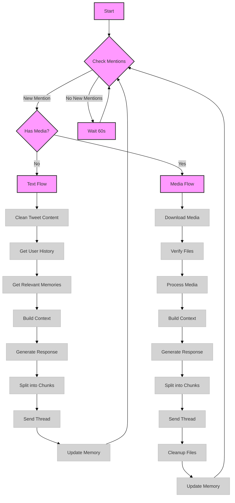
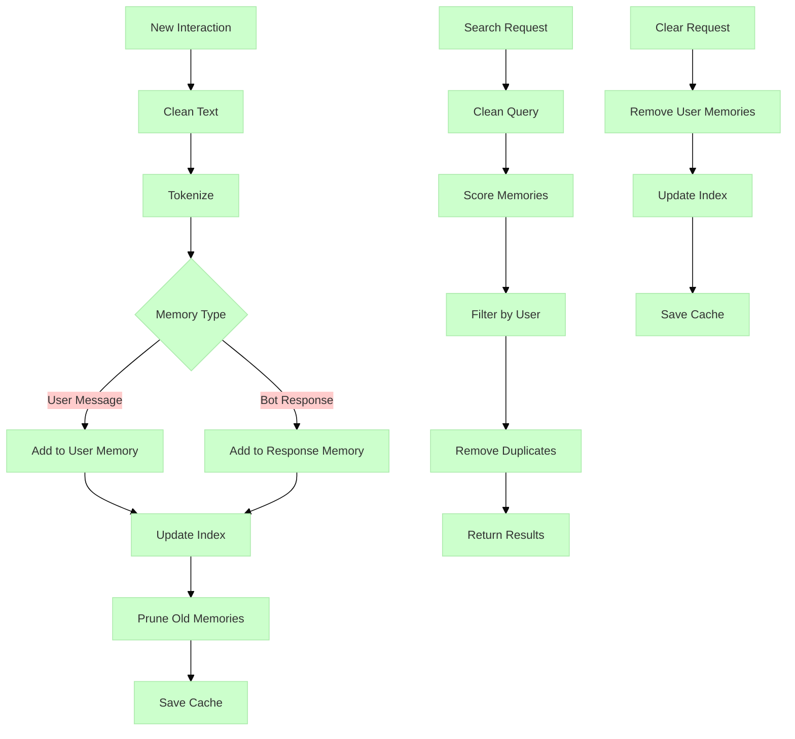

# Twitter Bot Agent Technical Analysis

## Overview
This is a Twitter bot that can interact with users, process media, maintain conversation history, and leverage various LLM APIs for generating responses. The system is built with modularity, error handling, and scalability in mind.

## Core Components

### 1. TwitterBot Class
The main orchestrator class that ties everything together:
- Initializes core components (memory index, cache manager)
- Handles Twitter API authentication and interaction
- Manages conversation flow and error handling
- Implements rate limiting and API request management

### 2. Message Handler (TwitterMessageHandler)
Responsible for processing and generating responses to tweets:
- Cleans and preprocesses tweet content
- Maintains conversation history
- Handles context building and response generation
- Splits responses into tweet-sized chunks for threading
- Manages media processing workflow

### 3. Media Handler (TwitterMediaHandler)
Dedicated to processing media attachments:
- Handles image downloads and verification
- Manages temporary file storage
- Processes text attachments
- Implements cleanup procedures

### 4. Memory System (UserMemoryIndex)
Sophisticated memory management system that:
- Maintains user-specific conversation histories
- Implements an inverted index for efficient memory search
- Handles deduplication of similar memories
- Provides relevance-based memory retrieval
- Uses token counting for context management

### 5. Cache Manager
Robust caching system that:
- Manages conversation history persistence
- Handles temporary file management
- Implements TTL (Time To Live) for cached items
- Provides user-specific cache isolation

### 6. API Integration
Flexible API client that supports multiple LLM providers:
- OpenAI
- Anthropic
- Ollama
- vLLM

## Key Features

### Conversation Management
- Maintains context across interactions
- Handles thread responses
- Implements rate limiting and error handling
- Supports media processing in conversations

### Memory and Context
- User-specific memory indexing
- Relevance-based memory retrieval
- Efficient deduplication
- Token-aware context management

### Media Processing
- Image verification and processing
- Temporary file management
- Multi-media support
- Cleanup procedures

### Error Handling
- Comprehensive error catching and logging
- Rate limit handling with automatic retry
- User notification system
- Detailed logging system

### Security and Privacy
- User-specific data isolation
- Temporary file management with TTL
- Secure API key handling
- Input sanitization

## Technical Specifications

### Dependencies
- tweepy: Twitter API interaction
- tiktoken: Token counting
- PIL: Image processing
- aiohttp: Async HTTP requests
- Various LLM APIs (OpenAI, Anthropic, etc.)

### Performance Features
- Asynchronous operation
- Rate limit handling
- Efficient memory indexing
- Cached conversation history

### Scalability Considerations
- Modular architecture
- Configurable parameters
- Multiple API support
- Efficient resource management

## Best Practices Implemented

1. **Error Handling**
   - Comprehensive try-except blocks
   - Graceful degradation
   - User feedback mechanisms
   - Detailed logging

2. **Security**
   - Input sanitization
   - Secure file handling
   - API key management
   - User data isolation

3. **Performance**
   - Asynchronous operations
   - Efficient caching
   - Memory management
   - Resource cleanup

4. **Maintainability**
   - Modular design
   - Clear documentation
   - Consistent coding style
   - Configuration management

## Usage Considerations

1. **API Configuration**
   - Requires appropriate API keys
   - Supports multiple LLM providers
   - Configurable model selection
   - Environment-based configuration

2. **Resource Management**
   - Implements file cleanup
   - Manages memory usage
   - Handles rate limits
   - Temporary storage management

3. **Monitoring**
   - Comprehensive logging
   - Error tracking
   - Performance monitoring
   - Usage statistics

# Memory Flow

