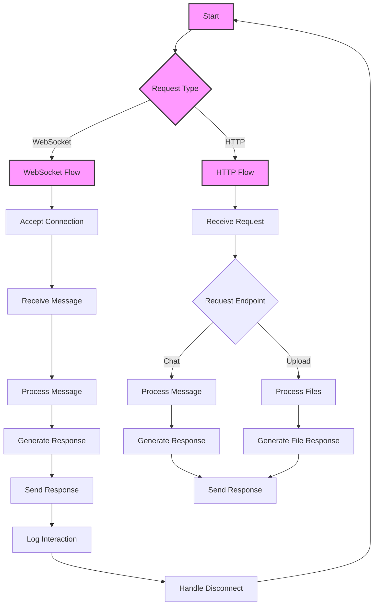
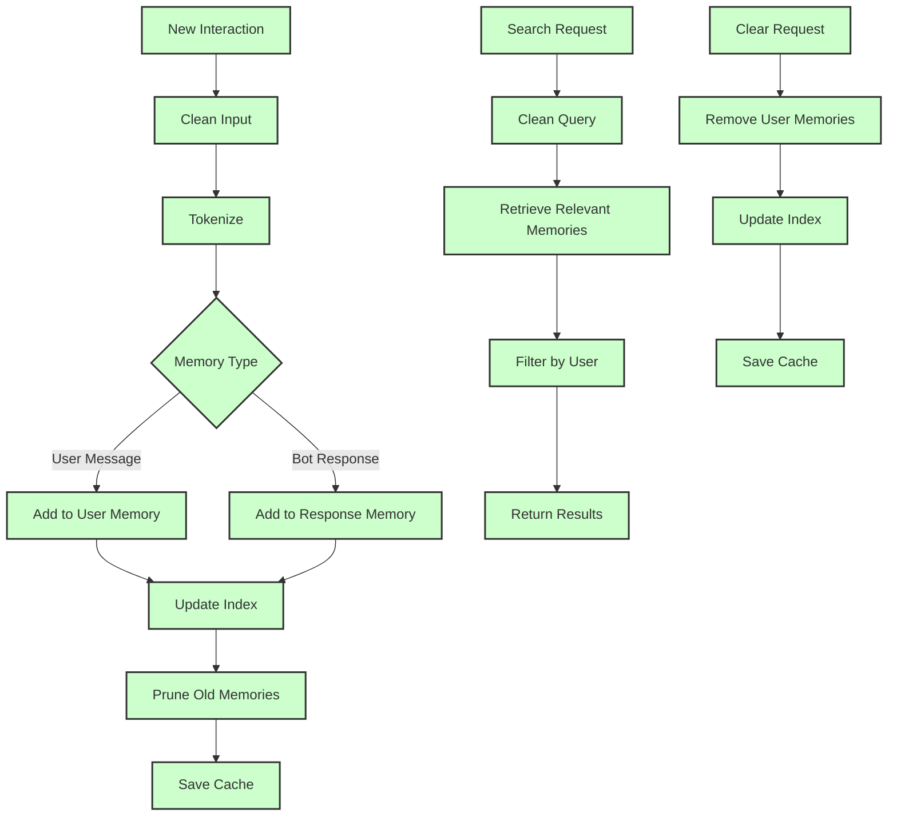

# Web Bot Agent Technical Analysis

## Overview
This is a web-based AI chatbot application built with FastAPI. It supports real-time interaction over WebSocket and HTTP, processes file uploads, maintains user-specific memory, and integrates with various LLM APIs for response generation. The architecture emphasizes modularity, scalability, and robust error handling.

## Core Components

### 1. WebBot Class
The primary orchestrator class that:
- Initializes core components (memory index, cache managers)
- Manages FastAPI app setup and routing
- Handles WebSocket and HTTP endpoints
- Implements CORS middleware for secure cross-origin requests

### 2. Message Processing
Centralized function to:
- Build context from user message, conversation history, and relevant memories
- Dynamically select and format prompt templates
- Generate responses using integrated LLM APIs
- Save conversation history and update user memory

### 3. File Processing
Handles user-uploaded files via:
- File type detection and processing
- Support for images and text-based files
- Cleanup of temporary storage after processing

### 4. Memory System (UserMemoryIndex)
Sophisticated memory handling that:
- Maintains user-specific conversation histories
- Implements relevance-based memory retrieval
- Supports memory addition, retrieval, and pruning
- Uses token-aware context management

### 5. WebSocket Management
Manages real-time connections via:
- Handling multiple concurrent WebSocket clients
- Broadcasting messages or sending personalized responses
- Disconnect handling and cleanup

### 6. Rate Limiting
Prevents overuse through:
- User-specific request tracking
- Configurable limits per time window
- Graceful error handling for rate-limit violations

### 7. API Integration
Supports flexible integration with LLM providers:
- OpenAI
- Anthropic
- Ollama
- vLLM

## Key Features

### Conversation Management
- Context-aware response generation
- Real-time WebSocket interactions
- Persistent conversation history
- Dynamic prompt selection

### Memory and Context
- User-specific memory indexing
- Efficient retrieval of relevant memories
- Deduplication of stored memories
- Pruning of old or redundant data

### File Upload Handling
- Processes images and text files
- Temporary storage with TTL (Time To Live)
- Type-specific handling for various file formats

### Error Handling
- Robust try-except blocks throughout
- Graceful WebSocket disconnects
- Detailed logging for diagnostics
- Comprehensive error messages for users

### Security and Privacy
- Input sanitization for user content
- Secure temporary file handling
- Isolation of user data
- Configurable CORS for origin restrictions

## Technical Specifications

### Dependencies
- **FastAPI**: Web framework
- **PIL**: Image processing
- **tiktoken**: Token counting
- **nltk**: Sentence tokenization
- **uvicorn**: ASGI server
- Various LLM APIs (OpenAI, Anthropic, etc.)

### Performance Features
- Asynchronous operations with FastAPI
- Configurable rate limiting
- Efficient memory indexing and retrieval
- File cleanup procedures

### Scalability Considerations
- Modular architecture for extensibility
- Support for concurrent WebSocket connections
- Multiple API support
- Configurable host and port settings

## Best Practices Implemented

1. **Error Handling**
   - Comprehensive try-except blocks
   - Graceful fallback mechanisms
   - Logging of error details
   - User-friendly error messages

2. **Security**
   - Input sanitization
   - Temporary storage management
   - API key management
   - Data isolation per user

3. **Performance**
   - Efficient caching
   - Token-aware memory management
   - Asynchronous WebSocket handling
   - Rate limit enforcement

4. **Maintainability**
   - Modular design
   - Configuration through environment variables
   - Clear and concise documentation
   - Consistent coding style

## Usage Considerations

1. **Configuration**
   - Requires API keys for LLM integrations
   - Environment variables for host and port
   - Configurable rate limiting and memory retention

2. **Resource Management**
   - Temporary storage cleanup
   - Memory pruning for outdated entries
   - Rate limiting to prevent overuse

3. **Monitoring**
   - Detailed logging system
   - JSONL-based interaction logs
   - Real-time WebSocket activity tracking

# Memory Flow

